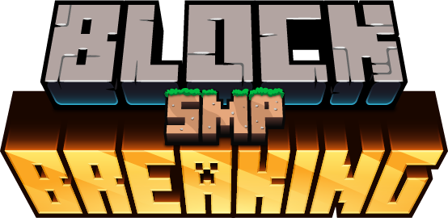

# Block_Breaking_SMP_mods
<div id="top"></div>
<!--
*** Thanks for checking out the Best-README-Template. If you have a suggestion
*** that would make this better, please fork the repo and create a pull request
*** or simply open an issue with the tag "enhancement".
*** Don't forget to give the project a star!
*** Thanks again! Now go create something AMAZING! :D
-->


<!-- PROJECT SHIELDS -->
<!--
*** I'm using markdown "reference style" links for readability.
*** Reference links are enclosed in brackets [ ] instead of parentheses ( ).
*** See the bottom of this document for the declaration of the reference variables
*** for contributors-url, forks-url, etc. This is an optional, concise syntax you may use.
*** https://www.markdownguide.org/basic-syntax/#reference-style-links
-->
[![Contributors][contributors-shield]][contributors-url]
[![Forks][forks-shield]][forks-url]
[![Stargazers][stars-shield]][stars-url]
[![Issues][issues-shield]][issues-url]
[![MIT License][license-shield]][license-url]

<!-- PROJECT LOGO -->
<br />
<div align="center">
  <a href="https://github.com/VoidAndCaffeine/Block_Breaking_SMP_mods/">
    
  </a>

<h3 align="center">Mods for Block Breaking SMP</h3>

  <p align="center">
    A quick and easy place to get your mods. I personaly will be using all of these as this Git links to my .minecraft folder. I will stay as up to date to my personal mods as possible. :)
    <br />
    <a href="https://github.com/VoidAndCaffeine/Block_Breaking_SMP_mods/issues">Report Bug</a>
    ·
    <a href="https://github.com/VoidAndCaffeine/Block_Breaking_SMP_mods/issues">Request A Mod</a>
    <br />
    <br />
  </p>
</div>

<br />

### Prerequisites

Basic fimiliarity with your OS and Minecraft be it Windows, OSX (apple/mac), or Linux

This includes:
* Knowing where .minecraft is, here are the default locations. If you use a custom launcher it is up to you.
    + Windows
    ```sh
    %APPDATA%\.minecraft\
    ```
    + OSX
    ```sh
    ~/Library/Application Support/minecraft/
    ```
    + Linux
    ```sh
    ~/.minecraft/
    ```
* The ability to unzip a file
* The ability to follow directions

Technecal prerequisite

* Fabric version 1.12.12 you can download the updater at https://fabricmc.net/use/installer/

<br />

### Installation

1. Download this repository
    + See the green button that says code?
      * It is in the upper right, below the bar that has code, issues, pull requests, projects, wiki...
    + Click on it, there should be a dropdown window
    + Click on Download zip


2. Unzip the file
    + Usually double click and follow the prompts


4. Copy the files to .minecraft
    + Open the decompressed file and select the mods, config, resourcepacks, and shaderpacks folders
      * If you are on Windows, also select the 3 FFMPEG .exe files
    + copy the selected files
    + Now go to your .minecraft folder, ctrl+v to paste, overwrite the files if asked

<br />
<br />
<br />

<!-- USAGE EXAMPLES -->
## Usage

It is kinda important that you use my config. I have changed a few from their default settings to give yall a better out of the box experence. (one of the mods had a donation request popup on the main menu that I dissabled)

If you run into any problem please open an issue, it is the best way to keep me organized and so that other people can see your problem and learn from it if they are having the same problem.

<br />
<br />
<br />

<!-- ACKNOWLEDGMENTS -->

WORK IN PROGRESS, Please wait for the mods to be updated

## Mods
##### Required
* [Simple Voice Chat](https://www.curseforge.com/minecraft/mc-mods/simple-voice-chat)    License: All Rights Reserved (the source is public tho interestingly enough)
    + In game voice chat, its probably the most important mod
* [status]

##### Fabr

##### Optifine replacement
* [Animatica](https://www.curseforge.com/minecraft/mc-mods/animatica)    License: GNU GPL v2
    + Adds extra animated texture pack support
* [CIT Resewn](https://www.curseforge.com/minecraft/mc-mods/cit-resewn)    License: MIT
    + Adds extra texture pack support
* [Continuity](https://www.curseforge.com/minecraft/mc-mods/continuity)    License: GNU GPL v3
    + Allows for Optifine connected textures with sodium.


* [AppleSkin](https://www.curseforge.com/minecraft/mc-mods/appleskin)    License: Public Domain (now that is an oddity, cool)
    + Shows your saturation level as a gold border arround your hunger.
* [Better Third Person](https://www.curseforge.com/minecraft/mc-mods/better-third-person)     License: All Rights Reserved
    + Allows for better camera movement in 3rd person, definately cool.
* [CEM]() License: 
* [Chat Heads](https://www.curseforge.com/minecraft/mc-mods/chat-heads)    License: Mozilla Public License v2
    + Ads players heads next to their name when they write in chat.
* [Cloth Config API](https://www.curseforge.com/minecraft/mc-mods/cloth-config/files)    License: GNU GPL v3
    + api mod.
* [Craft Presence](https://www.curseforge.com/minecraft/mc-mods/craftpresence)    Lisence: MIT
    + Discord rich presence, whats not to love :p.
* [Cull Leaves](https://www.curseforge.com/minecraft/mc-mods/cull-leaves)    License: MIT
    + Optimizes leaf rendering, makes trees look kinda auful without the better leaves resource pack
* [Durability Notifier](https://www.curseforge.com/minecraft/mc-mods/durability-notifier)    License: MIT
    + Like the Duraping Datapack but with some extra configurations and running client side.
* [EmoteCraft]
* [Enhanced Block Entities](https://www.curseforge.com/minecraft/mc-mods/enhanced-block-entities)    License: GNU GPL v3
    + Fixes the rendering of block entities (signs, chests, barrels, shulkers) so that they render like normal blocks. Also fixes the glow ink bug.
* [Fabric Api](https://www.curseforge.com/minecraft/mc-mods/fabric-api)     License: Apache v2
    + another api mod.
* [Falling Leaves](https://www.curseforge.com/minecraft/mc-mods/falling-leaves-fabric)    License: [Custom License](https://www.curseforge.com/project/417510/license) (another interesting oddity)
    + Adds leafs that fall from trees.
* [Ferrite Core](https://www.curseforge.com/minecraft/mc-mods/ferritecore-fabric)    License: MIT
    + Optimizes memmory usage
* [Indium](https://www.curseforge.com/minecraft/mc-mods/indium)    License: Apache v2
    + api mod.
* [Iris Shaders](https://www.curseforge.com/minecraft/mc-mods/irisshaders)    License: GNU GPL v3
    + ennables shaders with sodium.
* [krypton](https://www.curseforge.com/minecraft/mc-mods/krypton)    License: GNU GPL v3
    + Optimizes networks connections and fixes some security vulnerablilites. should help with the random disconnections
* [lazy DFU](https://www.curseforge.com/minecraft/mc-mods/lazydfu)    License: MIT
    + Optimizes game start, it delays the code that updates worlds from older versions to only start when needed. This means that loading old worlds is slower, but loading servers and new worlds are much quicker.
* [Mod Menu](https://www.curseforge.com/minecraft/mc-mods/modmenu)    License: MIT
    + Ads a mod menu cause fabric dosent have one built in.
* [Mouse Wheelie](https://www.curseforge.com/minecraft/mc-mods/mouse-wheelie)    License: Apache v2
    + adds some cool mouse wheel shortcuts for inventory management, check the forge page.
* [No Chat Reports]
* [Not Enough Animations](https://www.curseforge.com/minecraft/mc-mods/not-enough-animations)    License: MIT
    + adds some extra player animations, nice to have.
* [Sodium Options]
* [Replay Mod](https://github.com/ReplayMod/ReplayMod)    License: GNU GPL v3
    + I'm sure yall dont need me to explain this one. This one mod causes an astonishing amount of problems tho lol.
* [Sodium Extra](https://www.curseforge.com/minecraft/mc-mods/sodium-extra)    License: GNU GPL v3
    + Adds extra sodium config options to bring optifines "eye candy" fetures to fabric.
* [Replay compatable sodium]
* [Sodium](https://www.curseforge.com/minecraft/mc-mods/sodium)    License: GNU GPL v3
    + Godly performance mod, 60fps to 300fps.

* [WI zoom]

* [Bobby](https://www.curseforge.com/minecraft/mc-mods/bobby)    License: GNU GPL v3
    + Allows for render distances higher than what the server is configured for by cacheing chunks. Dissabled by default for performance reasons.
* [LambDynamicLights](https://www.curseforge.com/minecraft/mc-mods/lambdynamiclights)    License: MIT
    + Adds dynamic lighting when holding light sources, ie. torches. DO NOT WRITE THE NAME WITH SPACES. idk why but thats what the forge page says 🤷 Dissabled by default for performance reasons.

<!--* []()    License: 
    + Adds -->

<!-- ACKNOWLEDGMENTS -->
## Resource Packs

I will not be leaving discriptions for these, go look at the link. :)

* [Better Leaves](https://www.curseforge.com/minecraft/texture-packs/motschens-better-leaves)
* [Stay True](https://www.curseforge.com/minecraft/texture-packs/stay-true)
* [Vanilla Tweaks](https://vanillatweaks.net/picker/resource-packs/)
* [Biome Blocks](https://www.planetminecraft.com/texture-pack/biome-blocks-biome-variation/)
* [Dynamic Mobs](https://www.planetminecraft.com/texture-pack/more-mob-variants/)
* [Golem's Family](https://www.planetminecraft.com/texture-pack/golem-s-family/)
* [Trapped in Fall](https://www.planetminecraft.com/texture-pack/trapped-in-fall/)

## Shaders

I will not be leaving discriptions for these, go look at the link. :)

* [Complementary Shaders](https://www.curseforge.com/minecraft/customization/complementary-shaders)
* [BSL Shaders](https://bitslablab.com/bslshaders/)
* [Tea Shaders](https://www.curseforge.com/minecraft/customization/beyondbelief-vanilla-reborn)
* [SEUS Renewed](https://www.sonicether.com/seus/#downloads)
* [Sildurs Vibrant](https://www.curseforge.com/minecraft/customization/sildurs-vibrant-shaders)
* [Sildurs Enhanced Default](https://www.curseforge.com/minecraft/customization/sildurs-enhanced-default)

<p align="right">(<a href="#top">back to top</a>)</p>

<!-- MARKDOWN LINKS & IMAGES -->
<!-- https://www.markdownguide.org/basic-syntax/#reference-style-links -->
[contributors-shield]: https://img.shields.io/github/contributors/VoidAndCaffeine/Block_Breaking_SMP_mods.svg?style=for-the-badge
[contributors-url]: https://github.com/VoidAndCaffeine/Block_Breaking_SMP_mods/graphs/contributors
[forks-shield]: https://img.shields.io/github/forks/VoidAndCaffeine/Block_Breaking_SMP_mods.svg?style=for-the-badge
[forks-url]: https://github.com/VoidAndCaffeine/Block_Breaking_SMP_mods/network/members
[stars-shield]: https://img.shields.io/github/stars/VoidAndCaffeine/Block_Breaking_SMP_mods.svg?style=for-the-badge
[stars-url]: https://github.com/VoidAndCaffeine/Block_Breaking_SMP_mods/stargazers
[issues-shield]: https://img.shields.io/github/issues/VoidAndCaffeine/Block_Breaking_SMP_mods.svg?style=for-the-badge
[issues-url]: https://github.com/VoidAndCaffeine/Block_Breaking_SMP_mods/issues
[license-shield]: https://img.shields.io/github/license/VoidAndCaffeine/Block_Breaking_SMP_mods.svg?style=for-the-badge
[license-url]: https://github.com/VoidAndCaffeine/Block_Breaking_SMP_mods/blob/main/LICENSE
[product-screenshot]: images/screenshot.png
